# AI Automation Portfolio - Mehdi Belkassi

This repository showcases automation projects I built using **n8n, AI agents, APIs, webhooks, and SaaS tools**, with a focus on **process automation and AI-powered workflows**.

---

# Projects

## 1. Workflow Email Manager

**Status:** Active Development

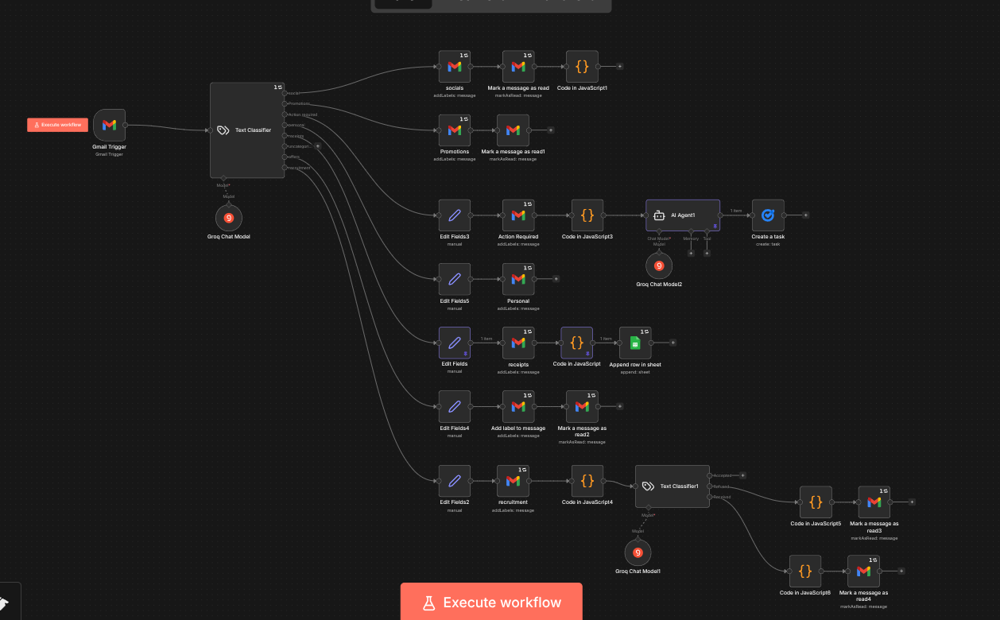

An AI-powered email management workflow built with **n8n** that automatically analyzes incoming Gmail messages and routes them according to their purpose.

The workflow can classify emails, apply Gmail labels, create Google Tasks for actionable messages, extract receipt information, and analyze recruitment emails.

**Technologies:** `n8n` · `Gmail` · `AI / LLMs` · `Groq` · `Google Sheets` · `Google Tasks` · `JavaScript`

[View Project →](./workflows/email-manager/README.md)

---

## 2. AI LinkedIn Publisher

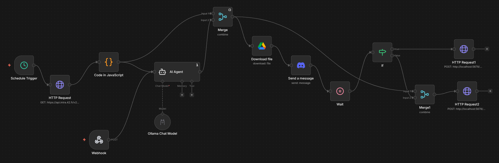
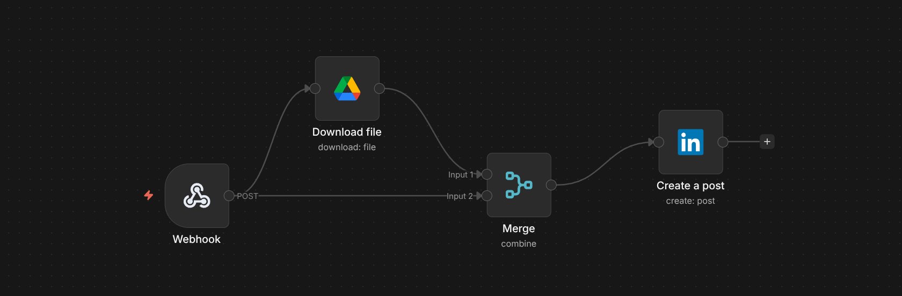

An automated workflow built with **n8n** that monitors my validated projects at **1337 Coding School (42 Network)** through an API and generates personalized LinkedIn posts using AI.

After manual approval through **Discord**, the workflow automatically publishes the approved post to LinkedIn.

**Technologies:** `n8n` · `REST API` · `AI Agent` · `Webhooks` · `Discord` · `LinkedIn API`

[View Project →](./workflows/42LinkedinPoster/README.md)

---

## 3. Tech Trend Keyword Extractor

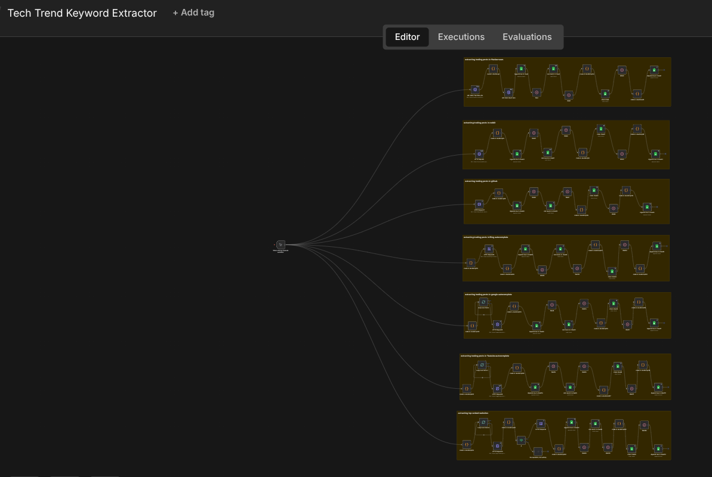
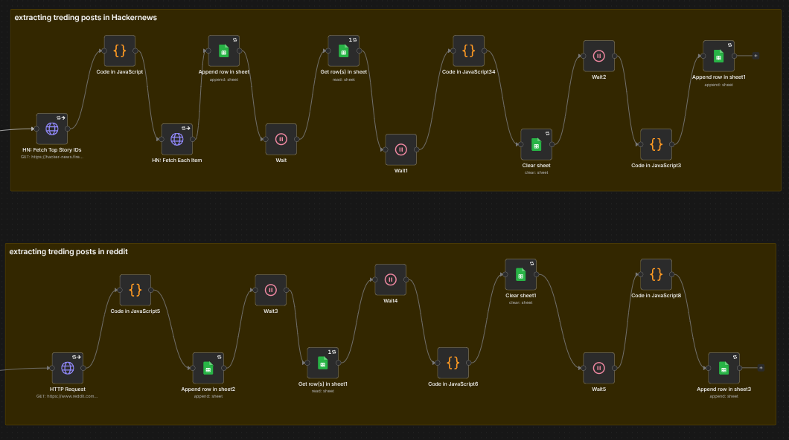
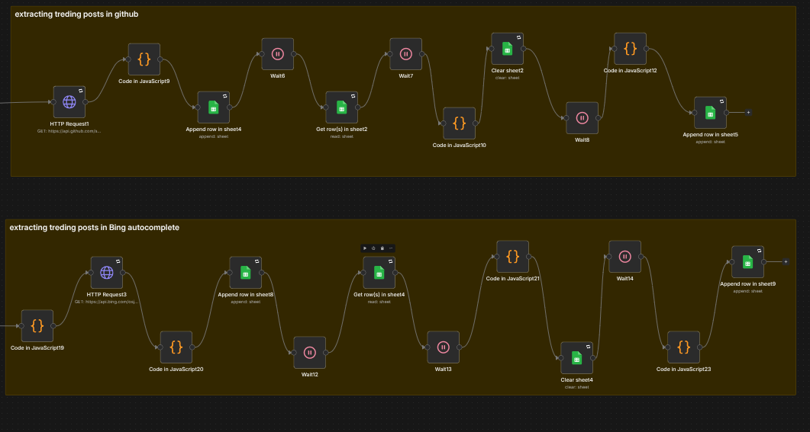
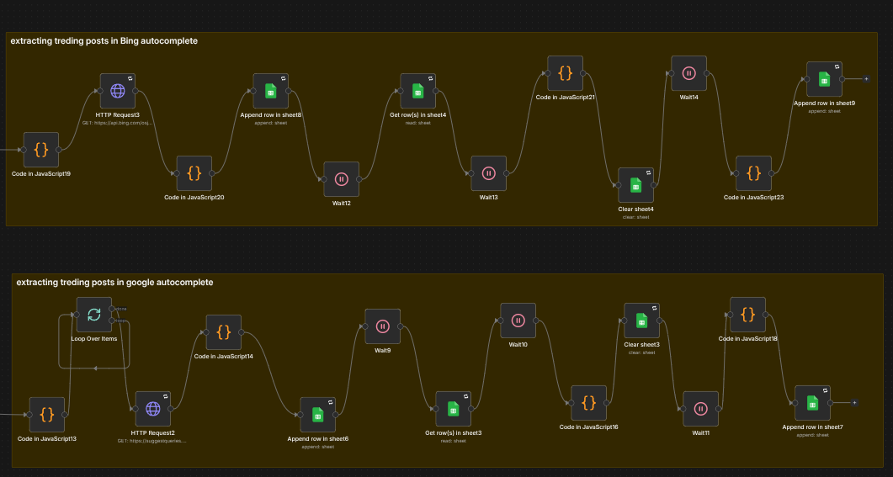
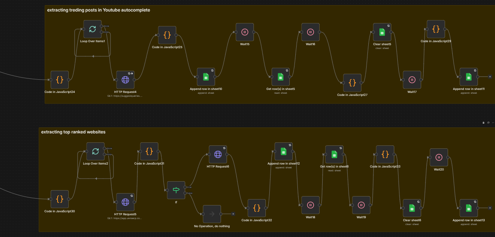

A multi-source trend research automation that collects trending topics and content from **six different platforms**, extracts relevant keywords, and stores the results in separate **Google Sheets** for monitoring and analysis.

**Technologies:** `n8n` · `Web Scraping` · `APIs` · `AI` · `Google Sheets` · `JavaScript`

[View Project →](./workflows/Tech-Trend-Keyword-Extractor/README.md)

---

## 4. Amazon Affiliate Automation with Pinterest

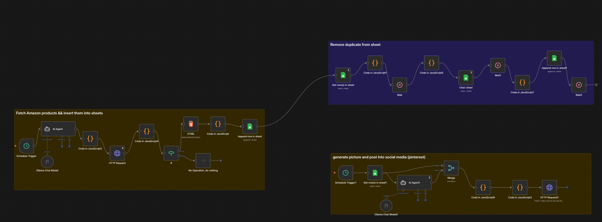
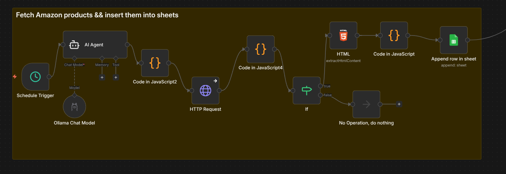
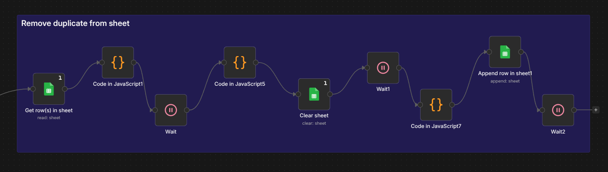

An automated workflow designed to streamline **Amazon affiliate content creation and Pinterest publishing**.

The workflow automates multiple steps of the process, reducing repetitive manual work and connecting different services into a single automated pipeline.

**Technologies:** `n8n` · `Amazon` · `Pinterest` · `AI` · `APIs` · `SaaS`

[View Project →](./workflows/AmazonAffiliateWithPinterest/README.md)

---

# Technologies & Skills

## Automation

* n8n
* Workflow Design
* No-Code / Low-Code Automation
* SaaS Integrations

## AI & LLMs

* AI Agents
* LLM Integration
* Prompt Engineering
* AI-powered Classification
* AI-powered Content Generation

## APIs & Development

* REST APIs
* Webhooks
* SQL
* JavaScript
* Python
* C / C++

## Integrations

* Gmail
* Google Sheets
* Google Tasks
* Discord
* LinkedIn API
* Pinterest
* Amazon

---

# Certification
**N8N Academy · 2026** - [View Certificate](https://badges.n8n.io/549663f4-67d8-44ca-9f13-7dd92e4cf346#acc.eqTrBc5o)

---

# About This Portfolio

These projects are continuously evolving as I experiment with new automation techniques, AI integrations, APIs, and workflow architectures.

More automation projects will be added over time.
